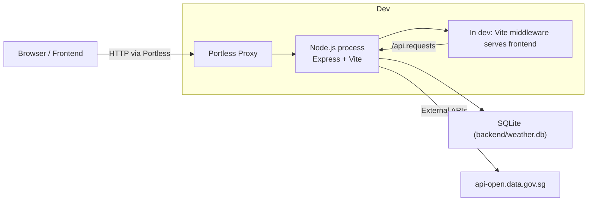
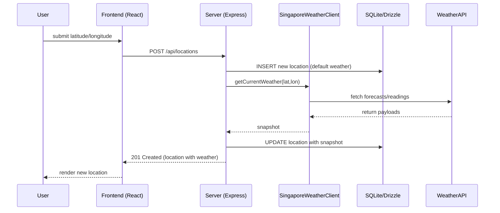

# System Architecture

Below are high-level diagrams that show how the development server, frontend, backend, and external weather APIs interact.

## Overall Architecture

## Create Location — Request Sequence

## Dev vs Production Serving

- Dev: createApp uses Vite in middleware mode — one Node process serves API and the frontend (hot reload).
- Production: frontend/static files are served from frontend/dist; Express falls back to index.html for SPA routing.
