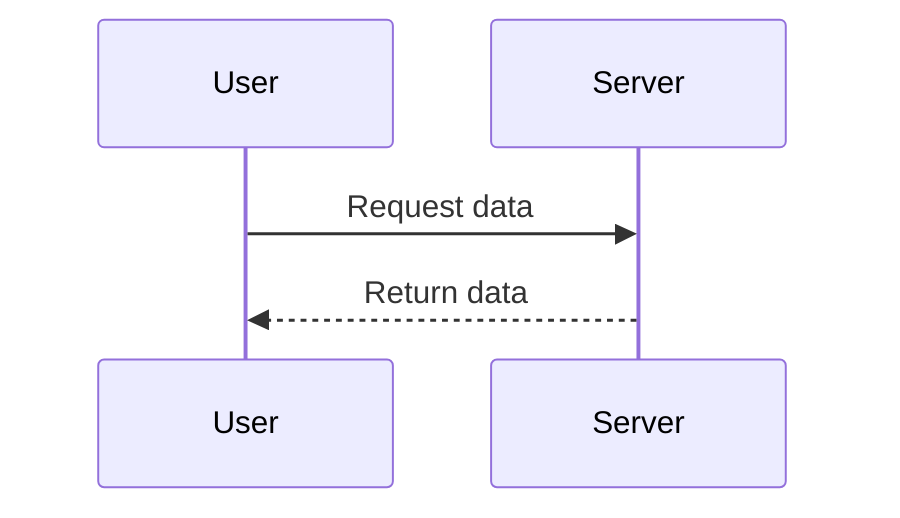
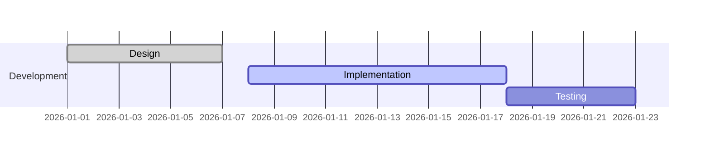
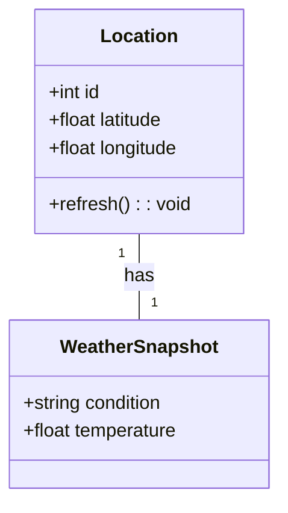

# Mermaid Diagrams

## Sequence Diagram

```mermaid
sequenceDiagram
  participant U as User
  participant S as Server
  U->>S: Request data
  S-->>U: Return data
```

## Gantt Chart

```mermaid
gantt
dateFormat  YYYY-MM-DD
section Development
Design       :done,    des1, 2026-01-01, 2026-01-07
Implementation:active,  dev1, 2026-01-08, 10d
Testing       :         test1, after dev1, 5d
```

## Class Diagram

```mermaid
classDiagram
  class Location {
    +int id
    +float latitude
    +float longitude
    +refresh(): void
  }
  class WeatherSnapshot {
    +string condition
    +float temperature
  }
  Location "1" -- "1" WeatherSnapshot : has
```
